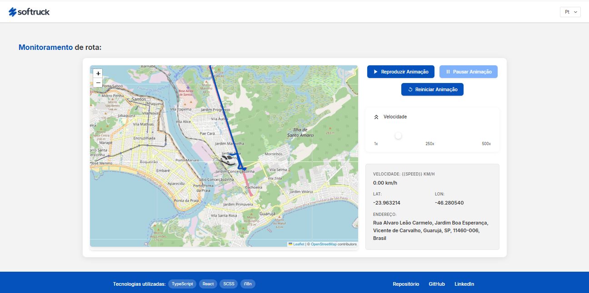

<h1>Softruck Tracking</h1>

<p align="center">
  
  
  
  
  
  
</p>
> Status do Projeto: :construction:

### Tópicos

:small_blue_diamond: [Descrição do projeto](#descrição-do-projeto)

:small_blue_diamond: [Funcionalidades](#funcionalidades)

:small_blue_diamond: [Como rodar a aplicação](#como-rodar-a-aplicação-arrow_forward)

## Descrição do projeto



<p align="justify">
  Aplicação de rastreamento de veículos utilizando mapas interativos com a biblioteca Leaflet e suporte a múltiplos idiomas com i18next.
</p>

## Funcionalidades

<p>
  Nesse projeto é possível visualizar mapas interativos com rastreamento de veículos em tempo real, alternar entre diferentes idiomas, e personalizar a visualização do mapa com marcadores e rotas.
</p>

## Como rodar a aplicação :arrow_forward:

No terminal, clone o projeto:

```
git clone https://github.com/YanGabrielDev/softruck-tracking.git
```

### APP

Pelo terminal, navegue para a pasta softruck-tracking e execute o comando:

```
yarn install
ou
npm install
```

Isso irá instalar as dependências da aplicação para execução no ambiente de desenvolvimento

Depois, basta executar o comando:

```
npm run dev
```

## Linguagens, dependências e libs utilizadas :books:

- [React](https://react.dev/) - Biblioteca principal para construção da interface.
- [TypeScript](https://www.typescriptlang.org/) - Linguagem utilizada para tipagem estática.
- [Leaflet](https://leafletjs.com/) - Biblioteca para mapas interativos.
- [React Leaflet](https://react-leaflet.js.org/) - Componentes React para integração com Leaflet.
- [i18next](https://www.i18next.com/) - Biblioteca para internacionalização.
- [i18next-browser-languagedetector](https://github.com/i18next/i18next-browser-languageDetector) - Detecta o idioma do navegador.
- [Sass](https://sass-lang.com/) - Pré-processador CSS para estilização.
- [ESLint](https://eslint.org/) - Ferramenta de linting para manter a qualidade do código.
- [Vite](https://vitejs.dev/) - Ferramenta de build e desenvolvimento rápido.

## Desenvolvedores/Contribuintes :octocat:

[<br><sub>Yan Gabriel</sub>](https://github.com/YanGabrielDev)

## Licença

The [MIT License]() (MIT)
